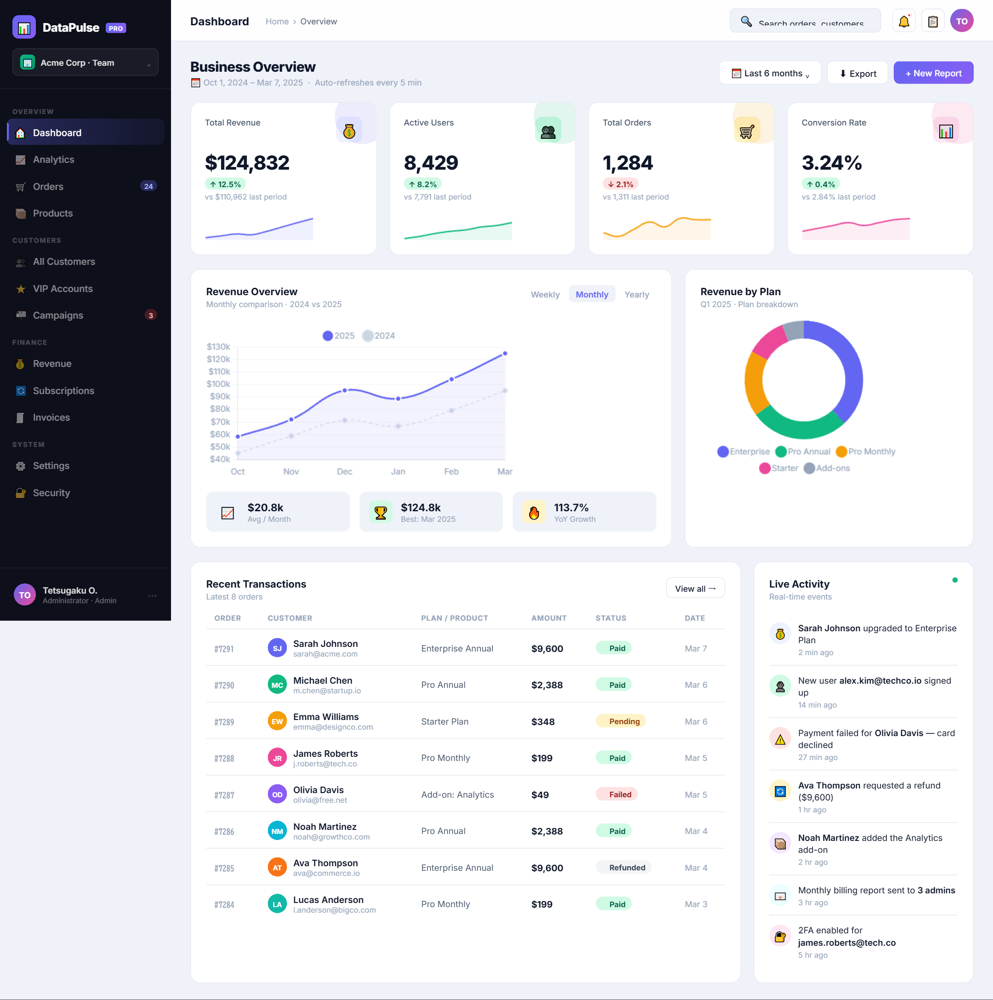
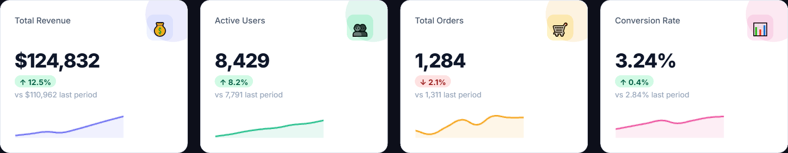
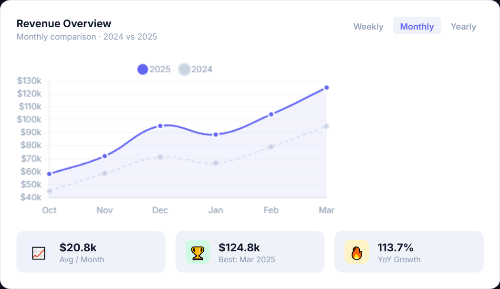

# DataPulse — SaaS Analytics Dashboard

A modern SaaS analytics dashboard with real-time KPI tracking, revenue charts, and transaction monitoring.

## Features

- 📊 Interactive revenue & user growth charts
- 💳 Recent transactions feed
- 📈 KPI cards (MRR, Active Users, Churn Rate, NPS)
- 🌙 Dark/light mode UI
- 🔒 Login screen with authentication flow
- 📱 Responsive layout

## Tech Stack

- React (component-based architecture)
- JavaScript / HTML5 / CSS3
- Chart.js for data visualization
- Tailwind CSS styling

## Screenshots

## Live Demo

Open `index.html` in your browser to view the dashboard.
